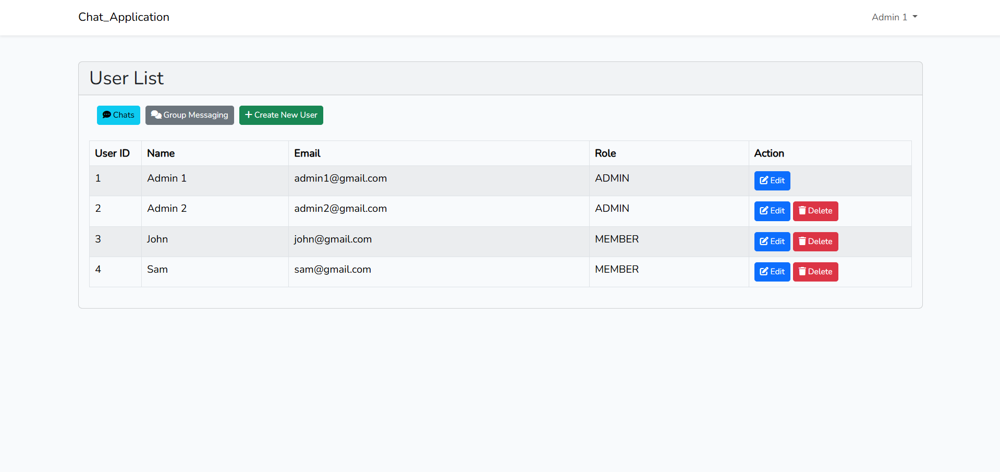
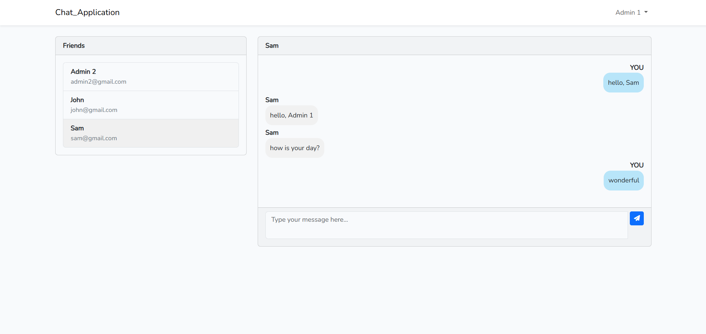
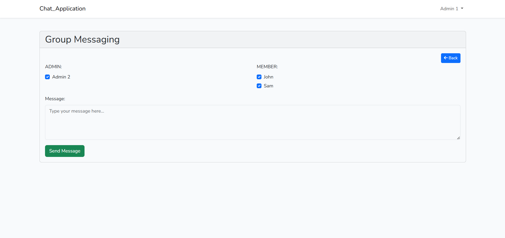

# User List


# Chat Page


# Group Messaging Page


# Chat Application

Membership Platform with In-Webapp Messaging Feature

A working prototype for a membership platform featuring a real-time messaging
system within the web app. This platform will allow an admin to manage members and
enable messaging between users, ensuring seamless communication with a minimal lag
time of up to 5 minutes.

## Installation


(1) Installing dependencies


```bash
  composer install
```

```bash
  npm install
```


(2) Setup, Migration and seeding

- Create app at https://dashboard.pusher.com/channels
- Create app keys
- Set your pusher app keys data in .env file

Configure your database in the .env file.otherwise copy .env.example .

Setup BROADCAST_DRIVER and PUSHER config

BROADCAST_DRIVER=pusher

PUSHER_APP_ID=your_pusher_app_id
PUSHER_APP_KEY=your_pusher_app_key
PUSHER_APP_SECRET=your_pusher_app_secret
PUSHER_APP_CLUSTER=your_pusher_app_cluster


Then, run the following command -


 ```bash
  php artisan migrate
```

```bash
  php artisan db:seed
```

(3) Run the project

```bash
  npm run dev
```

```bash
  php artisan serve
```

Done!! The application should now be running on your localhost at port 8000.

## Accounts

(1) Admin Accounts

- admin1@gmail.com
- admin2@gmail.com

(2) User Accounts

- john@gmail.com
- sam@gmail.com

  Default password is "password".

  Or just register to create a user account.
  
  Login route  is '/login'.
  
  Register route  is '/register'.

  Chat route  is '/chat'.

  User route  is '/users'. (For Admin Only)

    
## Features

- User Management
- User Authenthication & Authorization (role-based)
- Real-Time Private Messaging Between Users
- Bulk Group Messaging by ADMIN

## Languages

PHP, Javascript, Mysql

## Tech Stack

Laravel Framework, Vue.js

## Authors

- [@pyaepyaehan](https://github.com/PyaeHan)
